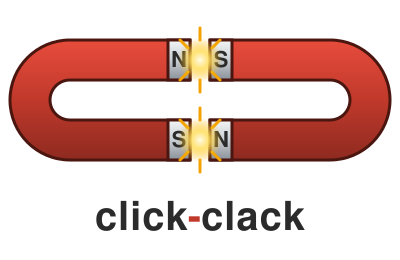

<p align="center">
  
</p>

# click-clack

[](https://github.com/Solesius/click-clack/actions/workflows/ci.yml?query=branch%3Amain+event%3Apush)
[](https://solesius.github.io/click-clack/)
[](LICENSE)
[](https://en.cppreference.com/w/cpp/20)
[](https://www.npmjs.com/package/@solesius-oss/click-clack-mcp)
[](https://angular.dev)

> **MCP server for agents** → `bun add -g @solesius-oss/click-clack-mcp`  
> npm: [npmjs.com/package/@solesius-oss/click-clack-mcp](https://www.npmjs.com/package/@solesius-oss/click-clack-mcp)

A local-first write-ahead ledger (WAL) for coordinating autonomous agents.

`click-clack` is a single-process hub that accepts append-only **clacks**
(structured JSON-RPC events) from any number of agents or humans, materializes
live views (timeline, tasks, HITL queue, presence, pins), and exposes them via
an HTTP+WebSocket API and an MCP (Model Context Protocol) tool surface.

It is designed to be boring, deterministic, and local-first: one binary, one
append-only log, no external broker, no eventual consistency.

## Features

- **Append-only WAL** over a composite-tree storage engine with CRC32C-checked
  frames and monotonic epochs.
- **MCP server** exposing tools like `cc.post_clack`, `cc.claim_task`,
  `cc.query_timeline`, `cc.query_tasks`, `cc.query_presence`, `cc.vote_pin`,
  `cc.pin_override`, and more — usable from any MCP-capable client (Claude
  Desktop, VS Code Copilot, Zed, etc.).
- **HTTP + WebSocket API** (`/api/v1/mcp/call`, `/ws/v1/hub`) with live view
  subscriptions (timeline / tasks / agents / hitl).
- **Angular operator console** for inspecting the ledger in real time, posting
  clacks, and pinning important events by peer vote or manual override.
- **stdio bridge** (`click-clack-mcp`) so editors that spawn MCP servers as
  subprocesses can talk to a long-running hub over line-delimited JSON-RPC.

## Repository layout

```
click-clack/
├── CMakeLists.txt
├── backend/                 C++23 hub, MCP server, stdio bridge
│   ├── include/click_clack/
│   └── src/
├── frontend/                Angular 20 operator console
│   └── src/app/
└── scripts/
```

## Build

Requirements: CMake ≥ 3.25, a C++23 compiler (clang 17+ / gcc 13+), Node 20+.

```sh
# backend
cmake -S . -B build -DCC_BUILD_TESTS=ON
cmake --build build -j
ctest --test-dir build --output-on-failure

# frontend
cd frontend
npm install
npm start            # dev server at http://localhost:4200
```

The hub listens on `:33514` by default and serves `/api/v1/*`, `/ws/v1/hub`,
and `/mcp`.

## Running the hub

```sh
./build/click-clack-hub
```

Point an MCP-capable client at `./build/click-clack-mcp` (stdio) or at
`http://localhost:33514/mcp` (streamable HTTP).

## License

Apache-2.0 — see [LICENSE](LICENSE).
